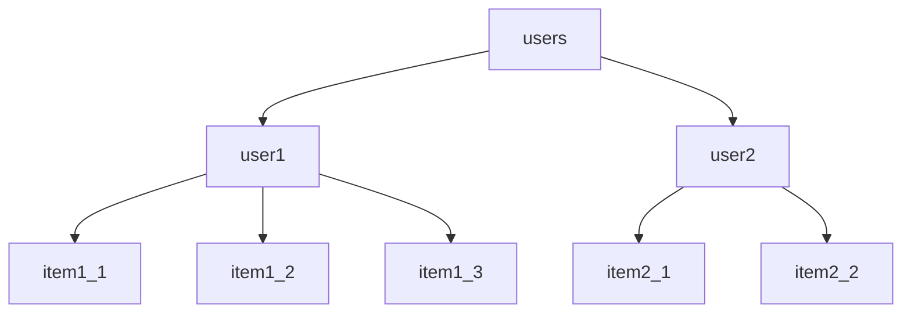

import { Callout, Steps, FileTree } from "nextra-theme-docs";
import MultipleChoice from "components/MultipleChoice";

# Cloud Firestore

Below is a playlist of 12 videos that will teach you how to use Cloud Firestore. I recommend watching the first 2 videos in order to get a good understanding of how to use Cloud Firestore.

<iframe
  style={{ width: "100%", aspectRatio: "16/9" }}
  src="https://www.youtube.com/embed/?listType=playlist&list=PLl-K7zZEsYLluG5MCVEzXAQ7ACZBCuZgZ"
  title="YouTube video player"
  frameBorder="0"
  allow="accelerometer; autoplay; clipboard-write; encrypted-media; gyroscope; picture-in-picture; web-share"
  allowFullScreen="allowFullScreen"
/>

## Introduction

Cloud Firestore, a key component of the Firebase platform, is a NoSQL document-oriented database. As a managed service provided by Google, it handles all the underlying infrastructure and maintenance, freeing you to concentrate on building your application.

In Cloud Firestore, data is structured into documents, which are then organized into collections. These documents, essentially sets of key-value pairs, can accommodate a variety of data types including strings, numbers, booleans, arrays, objects, or even null. Unlike traditional relational databases, Firestore's NoSQL structure allows for flexibility in data architecture as documents within a single collection are not required to share the same structure. Moreover, Firestore supports the creation of subcollections, enabling the nesting of collections within a document, thereby providing opportunities for more complex data organization.

## Structure Data

When building applications with Firestore, one of your primary tasks is to structure your data effectively. Firestore is a NoSQL, document-oriented database, which allows for flexible data structures. However, understanding the best ways to organize your data can greatly improve query performance and ease of development.

In Firestore, data is stored as documents, which are then organized into collections. Each document is a set of key-value pairs, similar to a JSON object. Documents can contain complex nested objects, or they can contain subcollections.

Your Firestore data structure should be influenced by the queries your application will perform. For example, if you frequently need to access all the items that a user has, you might structure your data with a users collection and an items subcollection within each user document. This would make it easy to retrieve all items for a specific user.

However, be mindful of Firestore's limitations, such as the inability to perform queries across multiple collections. Also, Firestore charges for the number of read, write, and delete operations you perform, so structure your data in a way that minimizes the number of operations you need for common tasks.

Here's an example of a possible data structure for a shopping list application,



In this structure, `users` is a collection that contains multiple `user` documents. Each `user` document could contain data about the user, like their userId and name. Each `user` document also has a subcollection of `item` documents. Each `item` document, in turn, contains information about the item. This structure makes it easy to retrieve all items for a user.

## Basic Operations

Firestore provides a complete set of APIs that allow you to perform a variety of operations on your data. These operations include Create, Read, Update, Delete (CRUD) operations, as well as real-time updates. Here's how you can use these operations in the context of our shopping list application.

### Create

Creating a new document in Firestore involves specifying the collection and then calling the add method with the data to be stored. For example, to create a new shopping list item:

```js copy
import { collection, addDoc } from "firebase/firestore";

const docRef = await addDoc(collection(db, "users", "user1", "items"), {
  name: "Milk 🥛",
  quantity: 1,
  category: "Dairy",
});
console.log("Item is created with ID: ", docRef.id);
```

### Read

Reading documents from Firestore can be done either by fetching a single document, or by querying for multiple documents.

To fetch a single document, like a specific item:

```js copy
import { doc, getDoc } from "firebase/firestore";

const docRef = doc(db, "users", "user1", "items", "item1_1");
const docSnap = await getDoc(docRef);

if (docSnap.exists()) {
  console.log("Item data:", docSnap.data());
} else {
  console.log("No such item!");
}
```

To query for multiple documents, like all items from with multiple quantities, use the where method on a collection reference:

```js copy
import { collection, query, where, getDocs } from "firebase/firestore";

const q = query(
  collection(db, "users", "user1", "items"),
  where("quantity", ">", 1)
);
const querySnapshot = await getDocs(q);
querySnapshot.forEach((doc) => {
  console.log(doc.id, " => ", doc.data());
});
```

### Update

To update a document in Firestore, reference the document and call the update method with the new data:

```js copy
import { doc, updateDoc } from "firebase/firestore";

const docRef = doc(db, "users", "user1", "items", "item1_1");
await updateDoc(docRef, {
  quantity: 12, // update the quantity to 12
});
```

### Delete

Deleting a document can be done by calling the delete method on a DocumentReference:

```js copy
import { doc, deleteDoc } from "firebase/firestore";

const docRef = doc(db, "users", "user1", "items", "item1_1");
await deleteDoc(docRef);
```

### Real-time Updates

Firestore also allows you to listen for real-time updates on documents and collections. This means you can update your app interface in real-time as data changes in the database. Here is an example of how to listen for changes to the list of items:

```js copy
import { doc, onSnapshot } from "firebase/firestore";

const colRef = collection(db, "users", "user1", "items");
const unsubscribe = onSnapshot(colRef, (snapshot) => {
  snapshot.forEach((doc) => {
    console.log(doc.id, " => ", doc.data());
  });
});

// Later, you can unsubscribe from the updates (e.g., when the component unmounts).
unsubscribe();
```

This code will print the current data for each item, and then print the new data every time the items are updated.

## Security Rules

Firebase's Cloud Firestore Security Rules provide a powerful and flexible way to manage access to your database at a granular level. They play a critical role in securing your Firestore data, and understanding them is essential to building secure Firebase applications.

Firestore Security Rules are custom expressions written in a syntax that closely resembles JavaScript. They control how incoming requests to read, write, or update data are handled. These rules can be tailored to your specific needs, allowing you to enforce who has access to your data, what data they can access, and what they can do with it.

Security rules can use various aspects of a request to decide whether to allow or deny access, such as authentication status, user roles, request time, or the request’s intended data. They are organized hierarchically to match the structure of your database, allowing you to specify rules for specific collections, documents, or fields.

Here's an example of a simple security rule:

```
service cloud.firestore {
  match /databases/{database}/documents {
    match /users/{userId} {
      allow read, write: if request.auth != null && request.auth.uid == userId;
    }
  }
}
```

In this example, access to documents in the users collection is controlled based on the user's authentication status and ID. The rule states that a user can read or write their own document (where the document ID matches their user ID), but only if they are authenticated (`request.auth != null`). This rule ensures that users can only access their own data, providing a basic level of data privacy and security.

<Callout type="warning" emoji="⚠️">
**Important: Firestore rules are NOT filters!**

They control access to data, but they do not change the data that is returned by a query. If a query attempts to retrieve data that the user does not have access to, the entire query will fail, rather than just omitting the inaccessible data. Always ensure that your queries only request data that the user has permission to access according to your Firestore rules.

</Callout>

## Next.js Skills

### Routing

#### Review Pages and Layouts

Pages are UI components that are unique to a route. They are defined by exporting a React component from a page.js file. Nested folders can be used to define a route and a page.js file makes the route publicly accessible. In the following example, there are two routes defined: `/` and `/shopping-list`.

<FileTree>
  <FileTree.Folder name="app" defaultOpen>
    <FileTree.File name="page.js" />
    <FileTree.Folder name="shopping-list" defaultOpen>
      <FileTree.File name="page.js" />
    </FileTree.Folder>
  </FileTree.Folder>
</FileTree>

Layouts are UI components that are shared across multiple pages. They preserve state and remain interactive on navigation without re-rendering. Layouts can also be nested. They are defined by default exporting a React component from a layout.js file. The component should accept a children prop that will be populated with a child layout or a child page during rendering.

<FileTree>
  <FileTree.Folder name="app" defaultOpen>
    <FileTree.File name="page.js" />
    <FileTree.File name="layout.js" />
    <FileTree.Folder name="shopping-list" defaultOpen>
      <FileTree.File name="page.js" />
    </FileTree.Folder>
  </FileTree.Folder>
</FileTree>

In this example, we define a layout.js file as the default layout for our application.

#### Route Groups

Route groups allow the organization of route segments and project files into logical groups without affecting the URL path structure. This is done by marking a folder as a Route Group to prevent it from being included in the route's URL path. Route groups are useful for organizing routes into groups, enabling nested layouts in the same route segment level.

A route group can be created by wrapping a folder's name in parenthesis: (folderName).

<FileTree>
  <FileTree.Folder name="app" defaultOpen>
    <FileTree.File name="page.js" />
    <FileTree.Folder name="(shopping-list)" defaultOpen>
      <FileTree.Folder name="list" defaultOpen>
        <FileTree.File name="page.js" />
      </FileTree.Folder>
      <FileTree.Folder name="new" defaultOpen>
        <FileTree.File name="page.js" />
      </FileTree.Folder>
    </FileTree.Folder>
    <FileTree.Folder name="(marketing)" defaultOpen>
      <FileTree.Folder name="about" defaultOpen>
        <FileTree.File name="page.js" />
      </FileTree.Folder>
    </FileTree.Folder>
  </FileTree.Folder>
</FileTree>

In this example, we define a route group for the shopping-list and marketing folders. The shopping-list folder contains two subfolders: list and new. The marketing folder contains a single subfolder: about. The route group folders are not included in the URL path, so the routes are `/`, `/list`, `/new`, and `/about`.

#### Dynamic Routes

Dynamic routes are used when the exact segment names are not known ahead of time and routes need to be created from dynamic data. Dynamic Segments can be created by wrapping a folder's name in square brackets: `[folderName]`. For example, `[id]` or `[slug]`.

<FileTree>
  <FileTree.Folder name="app" defaultOpen>
    <FileTree.File name="page.js" />
    <FileTree.Folder name="users" defaultOpen>
      <FileTree.File name="page.js" />
      <FileTree.Folder name="[id]" defaultOpen>
        <FileTree.File name="page.js" />
      </FileTree.Folder>
    </FileTree.Folder>
  </FileTree.Folder>
</FileTree>

In this example, we define routes for `/`, `/users`, and a dynamic route for a user's profile page, e.g. `/users/user1`. The user's ID will be used to fetch the user's data from the database.

Adding `...` to the beginning of a folder name will make it a catch-all route. This means that all routes that match the folder name will be handled by the file. For example, if we add a file named `...` to the users's id folder, `/users/[...id]`, it will handle all routes that start with `/users/`, e.g. `/users`, `/users/user1`, `/users/user1/profile`, etc.

## 🗒️ Summary

- **Cloud Firestore Basics**: Firestore is a NoSQL, document-oriented database that's part of Google's Firebase platform.
- **Data Structure**: he structure should be designed to minimize the number of read, write, and delete operations and to accommodate Firestore's limitations, such as the inability to perform queries across multiple collections.
- **Firestore Operations**: Firestore offers a complete set of APIs for Create, Read, Update, Delete (CRUD) operations, and real-time updates. These operations can be used to interact with the data in the context of an application.
- **Firestore Security Rules**: Security Rules in Firestore provide a way to manage access to your database. These rules, written in a JavaScript-like syntax, control how incoming requests to read, write, or update data are handled.
- **Route Groups**: Route groups in Next.js allow the organization of route segments and project files into logical groups without affecting the URL path structure. They are useful for organizing routes into groups and enabling nested layouts in the same route segment level.
- **Dynamic Routes in Next.js**: Dynamic routes are used when the exact segment names are not known in advance, and routes need to be created from dynamic data. Dynamic segments can be created by wrapping a folder's name in square brackets, such as [folderName].
- **Integration of Firestore with Next.js**: The combination of Firestore's flexible data structuring and Next.js's dynamic routing can enable the creation of powerful, dynamic web applications. For instance, a dynamic route in Next.js, such as /users/[id], can fetch a user's data from a Firestore document based on the user's ID.

## 📚 Knowledge Check

<MultipleChoice
  question="What type of database is Cloud Firestore?"
  choices={["SQL", "NoSQL", "Graph", "Object-relational"]}
  answer="2"
/>

<MultipleChoice
  question="In Firestore, how is data structured?"
  choices={[
    "Tables",
    "Documents and Collections",
    "Nodes and Edges",
    "Arrays and Objects",
  ]}
  answer="2"
/>

<MultipleChoice
  question="What operations can be performed on Firestore data?"
  choices={[
    "Create, Read, Update, Delete (CRUD)",
    "Pull, Push",
    "Merge, Rebase",
    "Commit, Checkout",
  ]}
  answer="1"
/>

<MultipleChoice
  question="What language closely resembles Firestore Security Rules syntax?"
  choices={["Python", "JavaScript", "C#", "Java"]}
  answer="2"
/>

<MultipleChoice
  question="In Next.js, what is a 'Page'?"
  choices={[
    "A template for a web page",
    "A UI component unique to a route",
    "A JavaScript library",
    "A CSS framework",
  ]}
  answer="2"
/>

<MultipleChoice
  question="What are 'Layouts' in Next.js used for?"
  choices={[
    "Styling pages",
    "Creating animations",
    "Sharing UI components across multiple pages",
    "Loading data from APIs",
  ]}
  answer="3"
/>

<MultipleChoice
  question="In Next.js, how is a 'Route Group' defined?"
  choices={[
    "By wrapping the folder's name in square brackets",
    "By marking a folder as a Route Group",
    "By wrapping the folder's name in parenthesis",
    "By appending 'RouteGroup' to the folder's name",
  ]}
  answer="3"
/>

<MultipleChoice
  question="How are 'Dynamic Routes' in Next.js defined?"
  choices={[
    "By wrapping the folder's name in square brackets",
    "By marking a folder as a Dynamic Route",
    "By wrapping the folder's name in parenthesis",
    "By appending 'Dynamic' to the folder's name",
  ]}
  answer="1"
/>

<MultipleChoice
  question="What is the purpose of Firestore Security Rules?"
  choices={[
    "To filter data returned by queries",
    "To manage access to the database",
    "To structure the data",
    "To improve the performance of queries",
  ]}
  answer="2"
/>

<MultipleChoice
  question="What should Firestore data structure be influenced by?"
  choices={[
    "The color scheme of your app",
    "The queries your application will perform",
    "The size of your team",
    "The coding language you're using",
  ]}
  answer="2"
/>

## 🌐 Demo

In this demo, Cloud Firestore is used to store data for a simple event management application. The application allows users to view all the events, view one event, and add a new event. Go ahead and add your own events to the database and see them appear in the application. The rest of the class will be able to see your events as well.

- [Week 10 Demo code](https://github.com/warsylewicz/webdev2-demos/tree/master/app/week10)
- [Live deployment](https://webdev2-demos.vercel.app/week10)

## 📖 Further Reading

- [Cloud Firestore Documentation](https://firebase.google.com/docs/firestore)
- [Next.js Routing](https://nextjs.org/docs/app/building-your-application/routing)
