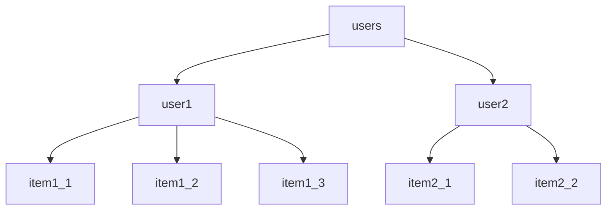

# CPRG-306

# Web Development 2

---

# Intro to Web Development 2

## Welcome

## Introductions

## Course Overview

---

## Welcome

- Instructor introduction

---

# Meet Each Other

Stand up, walk around. Talk to one person you know and one person you don't know. Ask each other:

1. What's your name?
2. Where are you from?
3. Why did you choose Software Development diploma at SAIT?
4. What do you want to be when you grow up (i.e. graduate)?

---

## What will you learn in this course?

- Learn intermediate JavaScript skills
- Learn how to build a full-stack web application using modern tools and technologies
- Develop a portfolio of web applications using technologies that are in high demand in the industry
- Essential course to prepare you for capstone (most projects are web apps)
- Learn how to use AI tools effectively

---

## Warning: THE COURSE CONTENT IS DIFFICULT

(I'm sorry)

Why? So many essential concepts and technologies and all are required to build a web application. Miss one and you're stuck.

E.g. command line interface, arrow functions, promises, objects, functions returning an array of functions, fetch API, React, Next.js, and much much more

---

## Weekly Class Structure

In person class (3 hours)

- Short lecture/demo
- Start and try to complete the weekly assignment

Online class (2 hours)

- Read the weekly content, complete the interactive exercises
- Get one-on-one help from your instructor

---

## This website

All content: schedule, readings, slides, activities, assignments, project

---

## Brightspace Course Shell

- Announcements
- Notification of deadlines (if subscribed)
- Grades

## GitHub

Assignment and project submissions

---

## Classroom Agreement

- Be prepared to make mistakes and learn from them
- Make wise choices to support your learning
- Collaborate and cooperate
- Work together to learn the material
- Include people if they look excluded
- Take ownership of your learning

---

## Getting Help

- During class time:
  - Help each other. Do not work alone.
  - Ask me in person or through MS Teams chat.
- Outside of class time:
  - Help each other. Do not work alone.
  - Free tutor (more details coming soon)
  - Stack Overflow, YT, Kagi/Google/DDG
  - Various AI tools, e.g. ChatGPT, Phind

---

## Deadlines

- All deadlines are posted in the schedule.
- Submissions prior to the deadline will be graded quickly, usually the next day.
- Submissions after the deadline will not be graded until December 11, 2024.
- Submissions after December 11, 2024 will not be accepted.

---

## Consequences of Late Submissions

- Assignments build on each other. If you miss one, you will have less time to complete the next one.
- You will have difficulty completing the project.
- Several grades of zero in a row may result in an automatic withdrawal from the course.

---

## FAQ

- Can I work ahead?
  - The course is not designed for you to work ahead, but there's no specific reason why you couldn’t. There is no speed limit.
- May I share code with my friends?
  - Yes. Collaboration is encouraged. Make sure you understand what you are doing. Remember: learning is your responsibility.
- Should I still come to class if it's not required?
  - Yes! Collaborate in person. Increase your personal network. Better and more positive experience.

---

# Introduction to Web Application Development

---

## Web Dev 1: Websites

## Web Dev 2: Web Applications

The big difference: _interactivity_

---

## Overview of Web Applications

- software that runs on a web server and is accessed through a web browser
- interactive and dynamic
- built using a combination of front-end and back-end technologies

---

## Typical Components of a Web Application

- Front-end
  - User interface
  - Client-side logic
- Back-end
  - Server-side logic
  - Database

---

---

## Discuss Week 1 Assignment

Demonstrate GitHub, GitHub Desktop, and VS Code.
